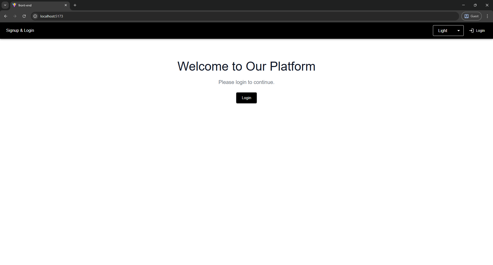
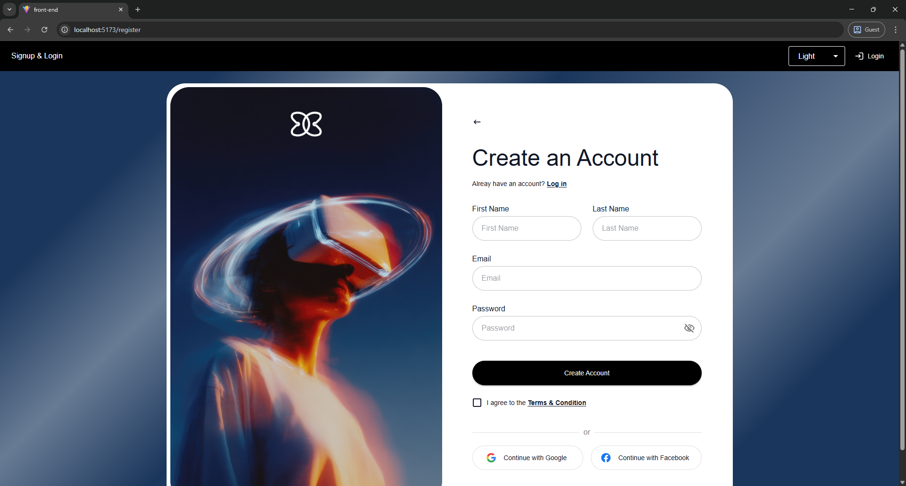
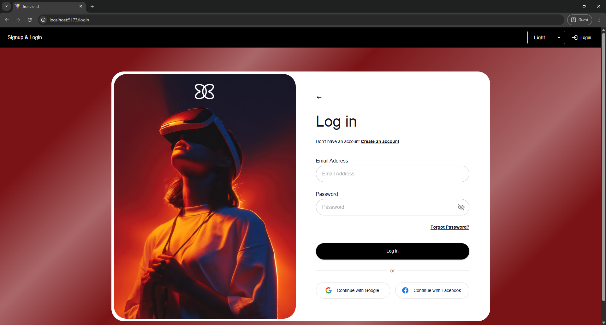
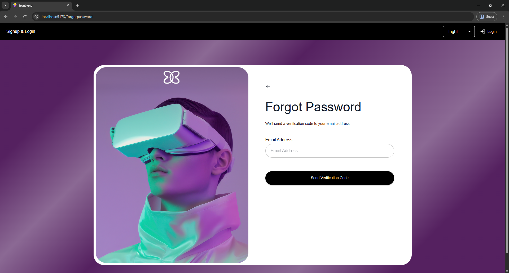
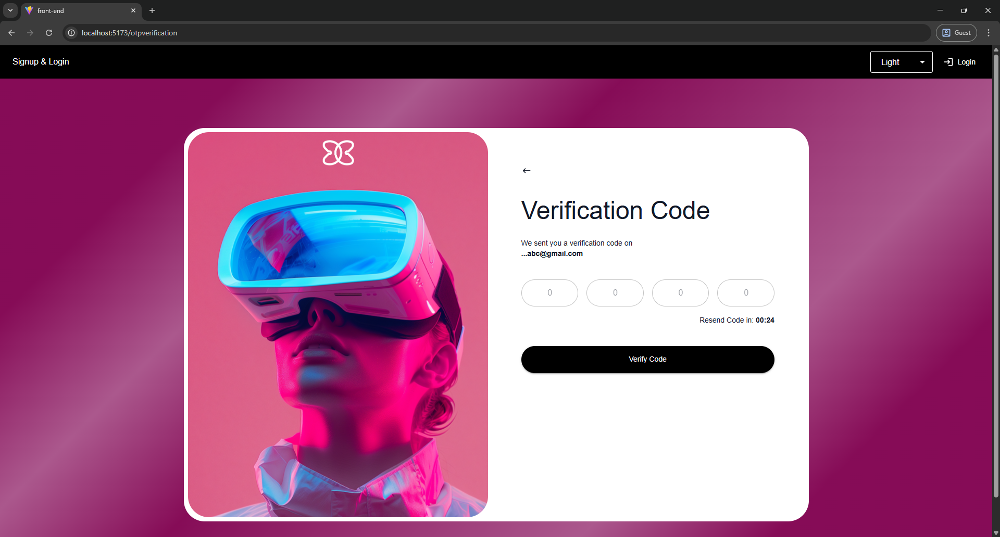
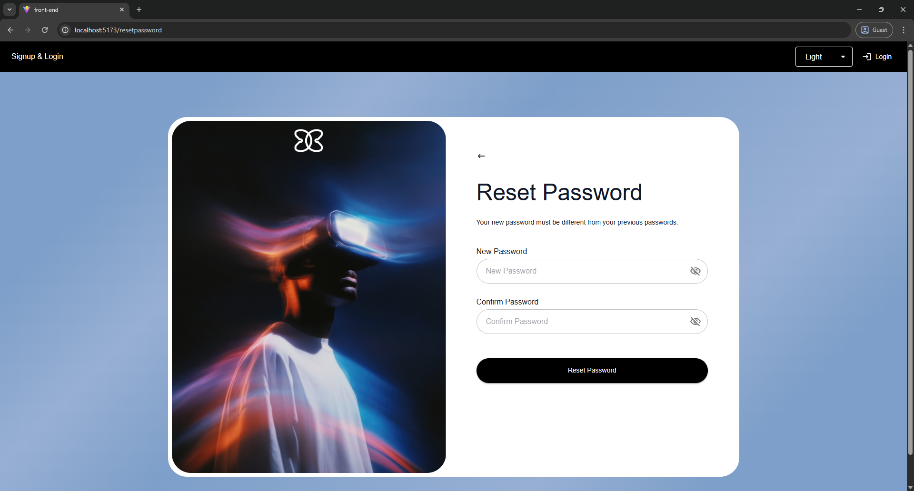

# 🔐 MERN Authentication System  
## Login & Signup with OTP Verification  

---

## 1️⃣ Project Introduction

This project is a full-stack authentication system built using the MERN stack (**MongoDB, Express, React, Node.js**). It provides a secure and modern user authentication workflow including:

- User Registration  
- Login  
- Email OTP Verification  
- Forgot Password  
- Reset Password  
- JWT Authentication (Access & Refresh Tokens)  
- Secure cookie handling  
- XSS & NoSQL Injection protection  
- Rate limiting & security headers    

The application follows best practices for **security, scalability, and clean architecture** by separating frontend and backend into independent modules.

---

## 📦 2️⃣ Libraries Used & Their Role in the Project

### 🔹 Backend Libraries

| Library | Purpose in Project |
|--------|------------------|
| express | Backend framework used to create API routes and handle HTTP requests |
| mongodb | Connects and interacts with MongoDB database |
| bcrypt | Hashes user passwords securely before saving to database |
| jsonwebtoken | Generates and verifies JWT access & refresh tokens |
| cookie-parser | Parses cookies from incoming requests |
| cors | Enables secure communication between frontend and backend |
| dotenv | Loads environment variables from .env file |
| nodemailer | Sends OTP and password reset emails |
| otp-generator | Generates secure OTP codes |
| validator | Validates email format and input fields |
| helmet | Adds secure HTTP headers |
| express-rate-limit | Prevents brute force attacks by limiting requests |
| mongo-sanitize | Protects against NoSQL injection attacks |
| sanitize-html | Prevents XSS (Cross-Site Scripting) attacks |
| crypto | Used for secure token and random value generation |
| nodemon | Automatically restarts backend during development |

---

### 🔹 Frontend Libraries

| Library | Purpose in Project |
|--------|------------------|
| react | Core frontend library |
| vite | Fast frontend build tool |
| react-router-dom | Handles routing between pages |
| @reduxjs/toolkit | Manages global authentication state |
| react-redux | Connects Redux store with React components |
| @mui/material | Provides modern UI components |
| @mui/icons-material | Material UI icons |
| dotenv | Loads frontend environment variables |

---

## 🎨 3️⃣ Frontend Overview

The frontend is built using **React + Vite** and follows a clean folder structure:

```bash
components/      → Reusable UI components (InputField, PasswordField, Buttons, Layouts)
features/auth/   → Authentication pages (Login, Register, OTP, Forgot Password, Reset Password)
app/             → Redux store and API slices
routes/          → Application routing setup
theme/           → Material UI theme customization
utils/           → Helper functions for managing user state
✨ Key Features:

Modern UI using Material UI (MUI)

Dark/Light theme toggle

Redux Toolkit for authentication state management

Protected routes

Automatic token refresh handling

Clean and responsive layout

The frontend communicates with the backend via secure HTTP-only cookies.

🖥 4️⃣ Backend Overview

The backend is built with Node.js + Express and follows a modular architecture:

controllers/ → Business logic for authentication
routes/      → API route definitions
models/      → MongoDB database logic
middleware/  → Authentication, sanitization, XSS protection
utils/       → Helper functions (OTP generation, email sending, token generation)
config.js/   → Database connection
🔐 Backend Security Features:

Password hashing with bcrypt

JWT Access & Refresh Tokens

HTTP-only cookies

Email OTP verification

Rate limiting

Helmet security headers

XSS protection

NoSQL injection protection

Input validation

The backend ensures that all sensitive operations are secure and production-ready.

🚀 5️⃣ How To Run The Project (Step-by-Step Guide)

Follow these steps carefully.

🔹 STEP 1: Clone the Repository
git clone https://github.com/HassanJaved78/Login-Signup-Website.git
cd Login-and-Signup
🔹 STEP 2: Setup & Run Backend (FIRST)
1️⃣ Go to Backend folder
cd Backend
2️⃣ Install dependencies
npm install
3️⃣ Setup Environment Variables

Create a .env file inside the Backend folder.

You can copy from example.env and update the values.

PORT=5000
MONGO_URI=your_mongodb_connection_string
JWT_ACCESS_SECRET=your_access_secret
JWT_REFRESH_SECRET=your_refresh_secret
EMAIL_USER=your_email@gmail.com
EMAIL_PASS=your_email_password
CLIENT_URL=http://localhost:5173

⚠️ Make sure MongoDB is running (local or cloud Atlas).

4️⃣ Start Backend Server
npm run dev

If successful, you should see:

Server running on port 5000
Database connected successfully

Leave this terminal running.

🔹 STEP 3: Setup & Run Frontend

Open a new terminal window.

1️⃣ Go to Frontend folder
cd Front end
2️⃣ Install dependencies
npm install
3️⃣ Setup Frontend Environment Variables

Create a .env file inside Front end folder.

VITE_BASE_URL=http://localhost:5000/api
4️⃣ Start Frontend
npm run dev

You will see something like:

Local: http://localhost:5173/

Open that URL in your browser.

✅ Now Your Project Is Running!

Backend → http://localhost:5000

Frontend → http://localhost:5173

You can now:

Register a new user

Verify OTP via email

Login

Reset password

🛡 Security Features Implemented

Password hashing

Access & refresh token system

HTTP-only secure cookies

Rate limiting

XSS protection

NoSQL injection prevention

Email verification

Input validation

📌 Future Improvements

Google OAuth login

Role-based authentication (Admin/User)

Account lockout after multiple failed logins

Docker deployment

CI/CD integration

👨‍💻 Author

Developed as a full-stack authentication system demonstrating secure production-level authentication architecture.

✉️ 6️⃣ How to Get Your OTP for Verification

Currently, the system uses NodeMailer with Ethereal Email for testing OTP delivery. This means the OTP email is not sent to a real email inbox, but instead a test email link appears in your backend terminal.

Steps to Access Your OTP:

Register a new user on your frontend app.

Check your backend terminal after submission — you will see a log like this:

Preview URL: https://ethereal.email/message/WaQKMgKddxQDoou...

Copy the Preview URL and open it in your browser.

The page will display the OTP sent to the user email.

Enter this OTP in the frontend OTP verification form to complete registration.

⚠️ Note: This is for testing only. In production, you would configure NodeMailer with a real email service (like Gmail, SendGrid, or SMTP) to send OTPs directly to users’ inboxes.

### Dashboard


### Registration Page


### Login Page


### Forgot Password Page


### OTP Verification Page


### Reset Password Page

